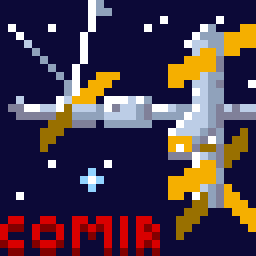
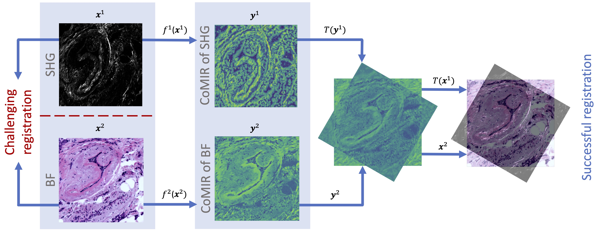
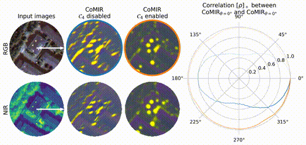

[](https://opensource.org/licenses/MIT)
[](https://www.python.org/download/releases/3.6.0/) 

<p align="center">
  
</p>
<h1 align="center">CoMIR: <b>Co</b>ntrastive <b>M</b>ultimodal <b>I</b>mage <b>R</b>epresentation for Registration Framework</h1>
<h4 align="center">🖼 Registration of images in different modalities with Deep Learning 🤖</h4>
<h4 align="center"><b><a href="mailto:nicolas.pielawski@it.uu.se">Nicolas Pielawski</a>, <a href="mailto:elisabeth.wetzer@it.uu.se">Elisabeth Wetzer</a></b>, <a href="mailto:johan.ofverstedt@it.uu.se">Johan Öfverstedt</a>, <a href="mailto:Jiahao.Lu.2199@student.uu.se">Jiahao Lu</a>, <a href="mailto:carolina.wahlby@it.uu.se">Carolina Wählby</a>, <a href="mailto:joakim.lindblad@it.uu.se">Joakim Lindblad</a> and <a href="mailto:natasa.sladoje@it.uu.se">Nataša Sladoje</a></h4>

Code of the NeurIPS 2020 paper: [CoMIR: Contrastive Multimodal Image Representation for Registration](https://proceedings.neurips.cc/paper/2020/file/d6428eecbe0f7dff83fc607c5044b2b9-Paper.pdf)
- [NeurIPS Abstract](https://proceedings.neurips.cc/paper/2020/hash/d6428eecbe0f7dff83fc607c5044b2b9-Abstract.html) page which lets you download *Supplemental material* as well
- [Pre-print version on arXiv](https://arxiv.org/abs/2006.06325)


## Table of Contents

- [Introduction](#introduction)
- [How does it work?](#how-does-it-work)
- [Key findings of the paper](#key-findings-of-the-paper)
- [Datasets](#datasets)
- [Animated figures](#animated-figures)
- [Reproduction of the results](#reproduction-of-the-results)
- [Scripts](#scripts)
- [Citation](#citation)
- [Acknowledgements](#acknowledgements)

## Introduction

[Image registration](https://en.wikipedia.org/wiki/Image_registration) is the
process by which multiple images are aligned in the same coordinate system.
This is useful to extract more information than by using each individual
images. We perform rigid multimodal image registration, where we succesfully align
images from different microscopes, even though the information in each image is completely different.

Here are three registrations of images coming from two different microscopes (Bright-Field and Second-Harmonic Generation) as an example:
<div align="center">
  <a href="https://youtu.be/zpcgnqcQgqM"><p>🎬 HD version on YouTube</p></a>
</div>

This repository gives you access to the code necessary to:
* Train a Neural Network for converting images in a common latent space.
* Register images that were converted in the common latent space.

## How does it work?

We combined a state-of-the-art artificial neural network ([tiramisu](https://github.com/npielawski/pytorch_tiramisu/))
to transform the input images into a latent space representation, which we baptized
CoMIR. The CoMIRs are crafted such that they can be aligned with the help of classical
registration methods.

The figure below depicts our pipeline:
<p align="center">
  
</p>

## Key findings of the paper

* 📉It is possible to use contrastive learning and integrate equivariance constraints during training.
* 🖼 CoMIRs can be aligned succesfully using classical registration methods.
* 🌀The CoMIRs are rotation equivariant ([youtube animation](https://youtu.be/iN5GlPWFZ_Q)).
* 🤖Using GANs to generate cross-modality images, and aligning those did not work.
* 🌱If the weights of the CNN are initialized with a fixed seed, the trained CNN will generate very similar CoMIRs every time (correlation between 70-96%, depending on other factors).
* 🦾Our method performed better than Mutual Information-based registration, the previous state of the art, GANs and we often performed better than human annotators.
* 👭Our method requires aligned pairs of images during training, if this condition cannot be satisfied, non-learning methods (such as Mutual Information) must be used.

## Datasets

We used two datasets:
* Zurich Summer Dataset: https://sites.google.com/site/michelevolpiresearch/data/zurich-dataset
* Multimodal Biomedical Dataset for Evaluating Registration Methods: https://zenodo.org/record/3874362

## Animated figures

The video below demonstrates how we achieve rotation equivariance by displaying
CoMIRs originating from two neural networks. One was trained with the C4
(rotation) equivariance constrained disabled, the other one had it enabled.
When enabled, the correlation between a rotated CoMIR and the non-rotated one is close
to 100% for any angle.

<div align="center">
  <a href="https://youtu.be/iN5GlPWFZ_Q"><p>🎬 HD version on YouTube</p></a>
</div>

## Reproduction of the results

All the results related to the Zurich satellite images dataset can be reproduced
with the train-zurich.ipynb notebook. For reproducing the results linked to the
biomedical dataset follow the instructions below:

**Important:** for each script make sure you update the paths to load the correct
datasets and export the results in your favorite directory.

### Part 1. Training and testing the models
Run the notebook named train-biodata.ipynb. This repository contains a Release
which contains all our trained models. If you want to skip training, you can
fetch the models named model_biodata_mse.pt or model_biodata_cosine.pt and generate
the CoMIRs for the test set (last cell in the notebook).

### Part 2. Registration of the CoMIRs

Registration based on SIFT:
1. Compute the SIFT registration between CoMIRs (using Fiji v1.52p):
```bash
fiji --ij2 --run scripts/compute_sift.py 'pathA="/path/*_A.tif”,pathB="/path/*_B.tif”,result=“SIFTResults.csv"'
```
2. load the .csv file obtained by SIFT registration to Matlab
3. run evaluateSIFT.m

### Other results

Computing the registration with Mutual Information (using Matlab 2019b, use >2012a):
1. run RegMI.m
2. run Evaluation_RegMI.m

## Scripts
The script folder contains scripts useful for running the experiments, but also
notebooks for generating some of the figures appearing in the paper.

## Citation
NeurIPS 2020
```
@inproceedings{pielawski2020comir,
 author = {Pielawski, Nicolas and Wetzer, Elisabeth and \"{O}fverstedt, Johan and Lu, Jiahao and W\"{a}hlby, Carolina and Lindblad, Joakim and Sladoje, Nata{\v{s}}a},
 booktitle = {Advances in Neural Information Processing Systems},
 editor = {H. Larochelle and M. Ranzato and R. Hadsell and M. F. Balcan and H. Lin},
 pages = {18433--18444},
 publisher = {Curran Associates, Inc.},
 title = {{CoMIR}: Contrastive Multimodal Image Representation for Registration},
 url = {https://proceedings.neurips.cc/paper/2020/file/d6428eecbe0f7dff83fc607c5044b2b9-Paper.pdf},
 volume = {33},
 year = {2020}
}
```

## Acknowledgements
We would like to thank Prof. Kevin Eliceiri ([Laboratory for Optical and Computational Instrumentation (LOCI)](https://eliceirilab.org/) at the University of Wisconsin-Madison) and his team for their support and for kindly providing the dataset of brightfield and second harmonic generation imaging of breast tissue microarray cores.
